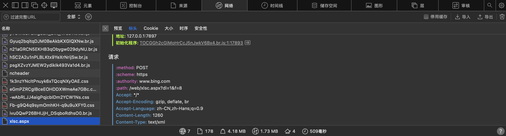

# 北航研究生抢课介绍
❗️首先感谢 [TonyYu02](https://github.com/TonyYu02/BUAA_Course_Enrollment) 
项目的主体框架copy自TonyYu，总算让我在选课结束前捡漏到了一门英语阅读课

因为这学期的英语线上课名额实在太少，不得不挂着脚本捡漏别人退选的课，如果恰好选走的是你退的课，在这里说一句抱歉

## 更详尽的说明
### 关于功能
实际上，这是一个自动post机。

你可以理解为，这段代码的用处就是不断向选课服务器发送 “我要选这门课” 的请求，最适用于该门课已经选满，而你需要选这门课，只能等有缘人退课的情况。

代码中并没有效果显著的逃避检测的方法，这表示会有被抓的风险，当然最多只是批评教育，只是抢课而已，对吧？但好像泥航并没有相关的检测，起码今年没有。

### 关于代码中你需要修改的部分
TonyYu大佬关于这部分的解释非常详尽，不再赘述，见[GitHub](https://github.com/TonyYu02/BUAA_Course_Enrollment) 

```python
'BJDM':'',#课程的代码
'lx':'',#类型
'skfsdm': "",  # 01线下上课，02线上上课
'fromKzwid':'', #课组wid
'fromDxzwid':'', #不知道是啥id的简称
```

> 如果你需要抢课组内的课，可能才会用到 fromKzwid，fromDxzwid

这里我想补充的是如何获取BJDM

* For Windows，按下 F12，之后再点击你想要抢的课，这会向服务器post一个请求，你可以在网页的开发者模块中的网络一栏看到。
* 如果你在使用代码的过程中发现post的请求不合法，修改代码，使得使用代码post的请求和直接在网页点击的请求一致，这会解决你的问题
* For Mac，option+command+u

请求类似于下图，当然这不是选课的网站，这是bing


### 关于代码中你不需要修改的部分
主要的优化体现在这里

Yu佬可能忽略了令牌过期的问题，在本项目中我修复了它，使得代码可以24小时不间断运行

### 关于yml

这是我运行时的虚拟环境，你不必全都和我一样，因为有些包和本项目无关

如果你出现了环境配置问题，也许这会对你有帮助

### 以上，希望对你有帮助
